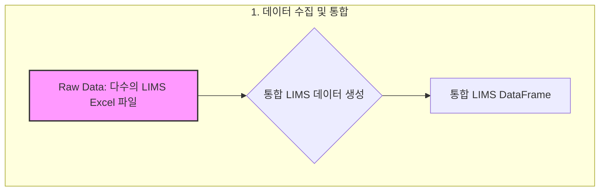
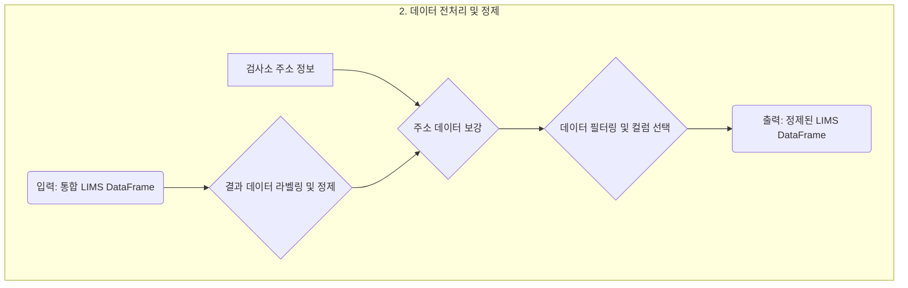
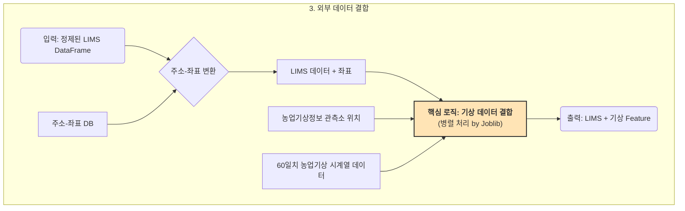
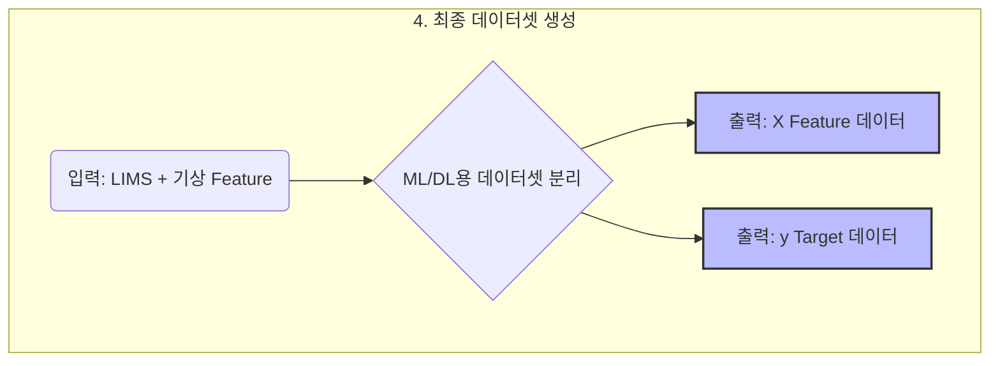

### 통합 LIMS 데이터 생성

```python
import pandas as pd
from glob import glob
import io

# ZIP 파일들이 있는 경로
root_path = "../data/통합_LIMS/*"
glob(root_path)

all_dfs = []

for dir in glob(root_path):
    print(f"[DIR] 처리 중: {dir}")  # ZIP 파일명 출력
    for file_name in glob(dir+'/*.xlsx'):
        df = pd.read_excel(file_name)
        df["source_file"] = '/'.join(file_name.split('/')[-2:])
        print(f"   └─ [Excel] {file_name} : {df.shape}")  # 내부 엑셀 파일명 출력
        all_dfs.append(df)

# 전체 병합
final_df = pd.concat(all_dfs, ignore_index=True)

print("\n=== 최종 병합 결과 샘플 ===")
print(final_df.head())
print(f"총 행 개수: {len(final_df)}")

# 통합된 df 저장
final_df.to_pickle('../working/통합_LIMS.pkl')
```

### Labeling: 수치 결과 만들어 내기
```python
df_통합_LIMS = pd.read_pickle('../working/통합_LIMS.pkl')

df_통합_LIMS['결과'] = None
df_통합_LIMS.loc[df_통합_LIMS['RESULT_VALUE']=='불검출', '결과'] = '불검출'
df_통합_LIMS.loc[df_통합_LIMS['RESULT_VALUE'].notnull() 
               & df_통합_LIMS['RESULT_VALUE'].fillna('').astype(str).str.contains(r'[0-9\.]+', regex=True), '결과'] = '수치'
df_통합_LIMS.loc[df_통합_LIMS['RESULT_VALUE'].isnull(), '결과'] = '결과없음'
df_통합_LIMS.loc[df_통합_LIMS['RESULT_VALUE'].notnull() 
               & df_통합_LIMS['RESULT_VALUE'].fillna('')
                 .str.replace(r'\(|-|\)| ', '')
                 .str.contains('불검|블검|불겁|불거|결과|Not|정량|음성|확인|적합|검출', regex=True), '결과'] = '불검출'
df_통합_LIMS.loc[df_통합_LIMS['결과']=='수치', '결과값'] = df_통합_LIMS.loc[df_통합_LIMS['결과']=='수치'].RESULT_VALUE.apply(lambda x: re.findall(r'[\d\.]+', str(x))[0])

df_통합_LIMS.groupby('JDGMNT_WORD_NAME').결과.value_counts().unstack()
```

### 사용주소 컬럼 생성 및 검사소 주소로 제조공장 주소 대체

```python
# 사용하는 주소의 종류를 표기
df_통합_LIMS['사용주소'] = '제조공장'
df_통합_LIMS.loc[df_통합_LIMS['MNFCTUR_CMPNY_LOCPLC_NM'].isnull(), '사용주소'] = '검사소'
df_통합_LIMS['사용주소'].value_counts()

# 먼저 검사소 이름으로 매칭해서 소재지를 갖고 오고 검사소_ID(unique 하지 않아 drop_duplicates)로 다시 소재재를 갖고 옴
df_통합_LIMS_merged = df_통합_LIMS.merge(df_검사소[['INSPCT_INSTT_NAME','기관 소재지']], on='INSPCT_INSTT_NAME', how='left')
df_통합_LIMS_merged = df_통합_LIMS_merged.merge(df_검사소.drop_duplicates('INSPCT_INSTT_CODE')[['INSPCT_INSTT_CODE','기관 소재지']], on='INSPCT_INSTT_CODE', how='left')
df_통합_LIMS_merged.shape

# 검사소 이름으로 매칭한 주소를 제조공장 주소에 넣음
df_통합_LIMS_merged.loc[df_통합_LIMS_merged['MNFCTUR_CMPNY_LOCPLC_NM'].isnull(), 'MNFCTUR_CMPNY_LOCPLC_NM'] = df_통합_LIMS_merged.loc[df_통합_LIMS_merged['MNFCTUR_CMPNY_LOCPLC_NM'].isnull(), '기관 소재지_x']
df_통합_LIMS_merged.loc[df_통합_LIMS_merged['MNFCTUR_CMPNY_LOCPLC_NM'].isnull(), 'MNFCTUR_CMPNY_LOCPLC_NM'] = df_통합_LIMS_merged.loc[df_통합_LIMS_merged['MNFCTUR_CMPNY_LOCPLC_NM'].isnull(), '기관 소재지_y']
df_통합_LIMS_merged['MNFCTUR_CMPNY_LOCPLC_NM'].isnull().sum()
df_통합_LIMS_merged.columns, df_통합_LIMS_merged.shape
df_통합_LIMS_기상정보_일조포함_결합_y = pd.read_pickle('../results/df_통합_LIMS_기상정보_일조포함_결합_60일_gzip_y.pkl', compression='gzip')
df_통합_LIMS_기상정보_일조포함_결합_y.shape
```

### 통합_LIMS에서 사용할 컬럼들만 별도 선택
```python
cols = ['INSPCT_PURPS_NAME', 'INSPCT_KND_NAME','PRDLST_NM','사용주소','MNFCTUR_CMPNY_LOCPLC_NM','REQEST_DE','SPLORE_STTUS_NAME','ORGPLCE_NATION_CODE','JDGMNT_WORD_NAME','결과','결과값']
df_통합_LIMS_merged[cols].head(2)
```

### 결과없음 제외
```python
df_통합_LIMS_주소포함_결과_결과값 = df_통합_LIMS_merged.query('결과!="결과없음"').query('MNFCTUR_CMPNY_LOCPLC_NM.notnull()')[cols]
df_통합_LIMS_주소포함_결과_결과값.to_pickle('../working/통합_LIMS_주소포함_결과_결과값.pkl')
df_통합_LIMS_주소포함_결과_결과값 = pd.read_pickle('../working/통합_LIMS_주소포함_결과_결과값.pkl')
df_통합_LIMS_주소포함_결과_결과값.head(2)
```

### 농업기상 정보 수집하기
```python
import requests
import xml.etree.ElementTree as ET
import pandas as pd
import time
import sqlite3
import numpy as np

def transform_to_df(response):
    xml_data = response.content.decode()

    # XML 파싱
    root = ET.fromstring(xml_data)

    # items 아래의 모든 item 추출
    items = root.find('.//items')
    item_list = []
    for item in items.findall('item'):
        item_dict = {child.tag: child.text for child in item}
        item_list.append(item_dict)

    # DataFrame 생성
    df = pd.DataFrame(item_list)
    return df

def get_spot_list():
    params = {
        'serviceKey': '여기에_본인_서비스키_data.go.kr에서_발급',
        'Page_Size': '300',
        'Page_No': '1',
        'type': 'json',
    }

    response = requests.get(
        'http://apis.data.go.kr/1390802/AgriWeather/getObsrSpotList',
        params=params,
        verify=False,
    )
    return transform_to_df(response)

def get_data_by_year(spot='026002D003', year=2024):
    params = {
        'serviceKey': '여기에_본인_서비스키_data.go.kr에서_발급',
        'Page_No': '1',
        'Page_Size': '366',
        'search_Year': year,
        'obsr_Spot_Code': spot,
    }

    response = requests.get(
        'https://apis.data.go.kr/1390802/AgriWeather/WeatherObsrInfo/V3/InsttWeather/getWeatherYearDayList',
        params=params,
    )
    return transform_to_df(response)

def insert_from_df(df, dest_table):

    conn = sqlite3.connect('working/weather_info.db')
    cursor = conn.cursor()

    query = (f'insert into {dest_table} \n('
            + ','.join(df.columns)
            + ')\n values \n('
            + ','.join(['?' for _ in df.columns])
            + ')' )
    data = df.replace(np.nan, None).values.tolist()

    try:
        rows_affected = 0
        for row in data:
            cursor.execute(query, row)
            rows_affected += cursor.rowcount
            if rows_affected % 500 == 0:
                conn.commit()
        conn.commit()
        conn.close()
        return [dest_table, rows_affected]
    except Exception as e:
        print(query)
        print(row)
        conn.close()
        return f'{e}'

df_spot = get_spot_list()
insert_from_df(df_spot.drop('no', axis=1), 'observation_spots')

for year in range(2015, 2026):
    temp = []
    for idx, spot in enumerate(df_spot.Obsr_Spot_Code.values):
        print(year, spot, end=' ')
        temp.append(get_data_by_year(spot, year).drop(['no', 'obsr_Spot_Nm'], axis=1))
        # time.sleep(0.1)
        if idx % 10 == 0:
            print()
    pd.concat(temp).to_pickle(f'working/observation_{year}.pkl')
```

### 주소 좌표 정보 가져오기
```python
import sqlite3
conn = sqlite3.connect(DB_FILE)
df_requests = pd.read_sql('select * from requests', conn)
df_address_data = pd.read_sql('select * from address_data', conn)
# 통합_LIMS의 unique한 주소
df_주소_위도_경도 = (df_통합_LIMS_주소포함_결과_결과값.drop_duplicates(['MNFCTUR_CMPNY_LOCPLC_NM'])[['MNFCTUR_CMPNY_LOCPLC_NM']] # 11922건
 .merge(df_requests.drop_duplicates('address_part_1'), 
        left_on='MNFCTUR_CMPNY_LOCPLC_NM', right_on='address_part_1') # 11771 
 .merge(df_address_data.drop_duplicates('request_address'), 
        left_on='successful_request_address', right_on='request_address') # 11771 
 [['MNFCTUR_CMPNY_LOCPLC_NM', 'x_coord', 'y_coord']]
)
```

### 실험에 사용된 데이터의 LIMS관련 index 및 전체 컬럼 정보 (기존 자료와 연결하기 위해 같은 일자와 위치정보 등의 정보를 활용해서 해당 건을 특정할 수 있음)
```python
df_농업기상정보_관측소 = pd.read_csv('../scraped_data/농업기상정보_관측소.csv')
df_농업기상정보 = pd.read_csv('../scraped_data/농업기상정보.csv'
                            , usecols=['obsr_Spot_Code','date_Time','tmprt_150','tmprt_150Top','tmprt_150Lwet',
                                       'hd_150','arvlty_300','arvlty_300Top','afp','sunshn_Time','solrad_Qy','soil_Mitr_10']
                            , dtype={'obsr_Spot_Code':str})

df_통합_LIMS_주소포함_결과_결과값 = df_통합_LIMS_merged.query('결과!="결과없음"').query('MNFCTUR_CMPNY_LOCPLC_NM.notnull()')#[cols]

df_통합_LIMS_주소포함_결과_결과값.merge(df_주소_위도_경도).to_pickle('../working/df_통합_LIMS_주소포함_결과_결과값_gzip.pkl', compression='gzip')
```

### 좌표 및 일자 정보를 이용 검사별 60일치 데이터 결합

```python
import pandas as pd
import numpy as np
from scipy.spatial import cKDTree
from datetime import timedelta
from joblib import Parallel, delayed  # <<-- joblib 임포트
import os
import time

# --- 0. 환경 설정 및 상수 정의 ---
N_NEIGHBORS_TO_CHECK = 20
WINDOW_SIZE = 60
WEATHER_COLS = [
    'tmprt_150', 'tmprt_150Top', 'tmprt_150Lwet', 'hd_150',
    'arvlty_300', 'arvlty_300Top', 'afp', 'sunshn_Time', 'solrad_Qy', 'soil_Mitr_10'
]
FLATTENED_COLS = [f'{col}_{day:02d}' for day in range(WINDOW_SIZE-1, -1, -1) for col in WEATHER_COLS]

# --- 1. 전처리 단계 ---
print("="*50)
print("Step 1/5: 데이터 전처리를 시작합니다...")
start_time_step1 = time.time()

# 1.1. 관측소 데이터 준비
df_spots = df_농업기상정보_관측소[['Obsr_Spot_Code', 'Instl_La', 'Instl_Lo']].copy()
df_spots.dropna(inplace=True)
spot_coords = df_spots[['Instl_La', 'Instl_Lo']].values
spot_tree = cKDTree(spot_coords)
spot_code_map = df_spots['Obsr_Spot_Code'].astype(str).reset_index(drop=True)
del df_spots

# 1.2. 날씨 데이터 준비
df_weather = df_농업기상정보[['obsr_Spot_Code', 'date_Time'] + WEATHER_COLS].copy()
df_weather.dropna(subset=['obsr_Spot_Code', 'date_Time'], inplace=True)
df_weather['obsr_Spot_Code'] = df_weather['obsr_Spot_Code'].astype(str)
df_weather['date_Time'] = pd.to_datetime(df_weather['date_Time'])

# 1.3. 60일 데이터 유효성 계산
df_weather.sort_values(['obsr_Spot_Code', 'date_Time'], inplace=True)
df_weather_temp = df_weather.set_index('date_Time')
rolling_counts = df_weather_temp.groupby('obsr_Spot_Code')[WEATHER_COLS[0]].rolling(window=WINDOW_SIZE).count()
rolling_counts = rolling_counts.reset_index()
valid_end_dates = rolling_counts[rolling_counts[WEATHER_COLS[0]] == WINDOW_SIZE]
valid_windows_set = set(zip(valid_end_dates['obsr_Spot_Code'], valid_end_dates['date_Time']))
del df_weather_temp, rolling_counts, valid_end_dates

# 1.4. 인덱싱된 날씨 데이터 생성
df_weather_indexed = df_weather.set_index(['obsr_Spot_Code', 'date_Time']).sort_index()
del df_weather

end_time_step1 = time.time()
print(f"Step 1/5: 전처리 완료. (소요 시간: {end_time_step1 - start_time_step1:.2f}초)")
print("="*50)


# --- 2. 병렬 처리를 위한 함수 정의 ---
def process_task_chunk(task_chunk_df, chunk_id, total_chunks):
    pid = os.getpid()
    chunk_size = len(task_chunk_df)
    print(f"[Chunk {chunk_id+1}/{total_chunks}, PID: {pid}] 처리 시작. (작업 수: {chunk_size})")
    start_time = time.time()

    # 이 함수 내에서는 메인 프로세스에 있는 전역 변수를 참조합니다.
    # joblib의 loky 백엔드는 COW(Copy-on-Write)를 지원하여 메모리 복사를 최소화합니다.
    
    task_coords = task_chunk_df[['y_coord', 'x_coord']].values
    distances, indices = spot_tree.query(task_coords, k=N_NEIGHBORS_TO_CHECK)
    
    task_ids = np.arange(chunk_size).repeat(N_NEIGHBORS_TO_CHECK)
    df_candidates = pd.DataFrame({
        'task_id': task_ids,
        'neighbor_rank': np.tile(np.arange(N_NEIGHBORS_TO_CHECK), chunk_size),
        'spot_index': indices.ravel(),
        'distance': distances.ravel()
    })
    df_candidates['Obsr_Spot_Code'] = df_candidates['spot_index'].map(spot_code_map)

    df_candidates = task_chunk_df.reset_index(drop=True).merge(df_candidates, left_index=True, right_on='task_id')
    df_candidates['is_valid'] = df_candidates.apply(
        lambda row: (row['Obsr_Spot_Code'], row['REQEST_DE']) in valid_windows_set,
        axis=1
    )
    df_valid_candidates = df_candidates[df_candidates['is_valid']].copy()
    
    if df_valid_candidates.empty:
        print(f"[Chunk {chunk_id+1}/{total_chunks}, PID: {pid}] 처리 완료. 유효한 후보 없음.")
        return pd.DataFrame()

    df_valid_candidates.sort_values(['task_id', 'neighbor_rank'], inplace=True)
    df_best_spot = df_valid_candidates.drop_duplicates(subset=['task_id'], keep='first').copy()
    
    df_best_spot = task_chunk_df.reset_index(drop=True).merge(df_best_spot, left_index=True, right_on='task_id')
    df_best_spot = df_best_spot[['x_coord_x', 'y_coord_x', 'REQEST_DE_x', 'Obsr_Spot_Code']].rename(
        columns={'x_coord_x': 'x_coord', 'y_coord_x': 'y_coord', 'REQEST_DE_x': 'REQEST_DE'}
    )

    weather_features_list = []
    for _, row in df_best_spot.iterrows():
        spot_code = row['Obsr_Spot_Code']
        end_date = row['REQEST_DE']
        start_date = end_date - timedelta(days=WINDOW_SIZE - 1)
        
        try:
            weather_data = df_weather_indexed.loc[(spot_code, start_date):(spot_code, end_date), WEATHER_COLS]
            if len(weather_data) == WINDOW_SIZE:
                flattened_features = weather_data.values.ravel()
                feature_dict = dict(zip(FLATTENED_COLS, flattened_features))
                feature_dict.update(row[['x_coord', 'y_coord', 'REQEST_DE']].to_dict())
                weather_features_list.append(feature_dict)
        except (KeyError, UnsortedIndexError):
            continue

    end_time = time.time()
    print(f"[Chunk {chunk_id+1}/{total_chunks}, PID: {pid}] 처리 완료. (소요 시간: {end_time - start_time:.2f}초, 결과 수: {len(weather_features_list)})")
    
    if not weather_features_list:
        return pd.DataFrame()
        
    return pd.DataFrame(weather_features_list)

# --- 3. 메인 실행 부분 ---
print("Step 2/5: 고유 작업 목록 생성 및 분할을 시작합니다...")
df_tasks = df_selected[['x_coord', 'y_coord', 'REQEST_DE']].drop_duplicates().reset_index(drop=True)
df_tasks['REQEST_DE'] = pd.to_datetime(df_tasks['REQEST_DE'].astype(str))

n_jobs = max(1, int((os.cpu_count() or 1) * 0.75))
n_chunks = n_jobs * 4  # 작업을 더 잘게 나누어 메모리 부담을 줄이고 진행 상황을 자주 확인
task_chunks = np.array_split(df_tasks, n_chunks)

print(f"총 {len(df_tasks)}개의 작업을 {n_chunks}개의 청크로 나누어 {n_jobs}개의 코어로 병렬 처리합니다...")
print("="*50)

# --- 4. 병렬 처리 실행 ---
start_time_step4 = time.time()
print("Step 3/5: 병렬 처리를 시작합니다...")

results_list = Parallel(n_jobs=n_jobs, verbose=0)(
    delayed(process_task_chunk)(
        chunk, i, len(task_chunks)
    ) for i, chunk in enumerate(task_chunks)
)

end_time_step4 = time.time()
print("="*50)
print(f"Step 3/5: 병렬 처리 완료. (총 소요 시간: {end_time_step4 - start_time_step4:.2f}초)")

# --- 5. 결과 취합 및 저장 ---
print("Step 4/5: 결과를 취합하고 최종 병합합니다...")
results_list = [res for res in results_list if not res.empty] # 비어있는 결과 제거
if results_list:
    df_tasks_with_features = pd.concat(results_list, ignore_index=True)
    del results_list

    df_selected['REQEST_DE'] = pd.to_datetime(df_selected['REQEST_DE'].astype(str))
    final_df = df_selected.merge(
        df_tasks_with_features,
        on=['x_coord', 'y_coord', 'REQEST_DE'],
        how='left'
    )
    del df_tasks_with_features

    print(f"최종 DataFrame 생성 완료. Shape: {final_df.shape}")

    print("Step 5/5: 최종 결과를 Pickle 파일로 저장합니다...")
    output_filename = 'final_weather_features.pkl'
    final_df.to_pickle(output_filename)
    print(f"'{output_filename}' 파일로 저장이 완료되었습니다.")
else:
    print("처리된 결과가 없어 최종 파일을 생성하지 않습니다.")

print("="*50)
print("모든 작업이 완료되었습니다!")
```

### ML/DL용 데이터 생성 및 배포
```python
final_df['결과값'] = final_df['결과값'].fillna(0)
final_df['결과값'].value_counts(dropna=False)
for col in final_df.columns:
    print(col)
cols_y = ['JDGMNT_WORD_NAME','결과','결과값']
cols_X = [col for col in final_df.columns if col not in cols_y+['REQEST_DE', 'x_coord', 'y_coord', '최근접_관측소']]
df_통합_LIMS_기상정보_결합_y = final_df[cols_y]
df_통합_LIMS_기상정보_결합_X = final_df[cols_X]
df_통합_LIMS_기상정보_결합_y.to_pickle('../results/df_통합_LIMS_기상정보_결합_60일_gzip_y.pkl', compression='gzip')
df_통합_LIMS_기상정보_결합_X.to_pickle('../results/df_통합_LIMS_기상정보_결합_60일_gzip_X.pkl', compression='gzip')
```