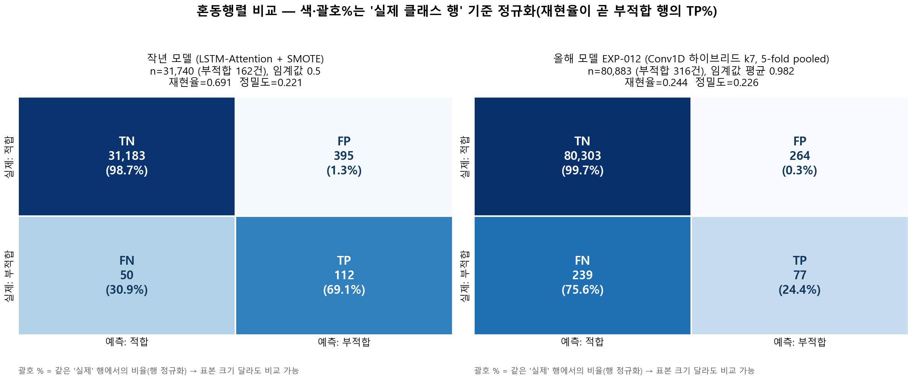

# 작년 모델 vs 올해 모델(EXP-011) 성능 비교

## 핵심 결론 (3줄)

1. **표면 수치는 작년이 높음** — 작년 recall 0.69 / PR-AUC 0.32 vs 올해 0.24 / 0.12.
---

## 1. 한눈 비교

| 항목 | 작년 모델 | 올해 EXP-011 |
|---|---|---|
| 구조 | LSTM(BiLSTM)-Attention | **Conv1D 2층** + BiLSTM-Attention |
| 불균형 처리 | **SMOTE**(합성 오버샘플링) | **class weighting**(손실 가중, pos_weight≈254) |
| 평가 방식 | **단일** train/test 분할 1회 | **StratifiedKFold 5-fold** |
| 테스트 표본 | 31,740 (양성 162, 0.51%) | 80,883 (양성 316, 0.39%) |
| 임계값 | **고정 0.5** / 사후 0.9 | **검증셋 F2 최적** → 평균 0.972 |
| Precision | 0.221 (@0.5) | **0.199** (pooled) |
| Recall | **0.691** (@0.5) | 0.237 (pooled) |
| **F2** (β=2) | **≈0.485** (@0.5) | **0.229** (pooled) |
| ROC-AUC | 미보고("불균형 ROC 무의미") | 0.660 ± 0.049 (fold) |
| PR-AUC (AP) | **0.32** | 0.124 ± 0.038 (fold) |

> - **F2**: 재현율에 4배 가중(β=2)한 점수. "놓치면 큰일"인 식품 안전에 적합, 올해 대표 지표. 작년도 같은 잣대로 환산: F2 = 5·P·R/(4P+R) = 5×0.221×0.691/(…) ≈ **0.485** → 표면적으로 작년 우세.
> - 올해 fold평균은 P 0.242±0.103 · R 0.238±0.042 · F2 0.231±0.044 (pooled와 약간 다른 건 fold마다 표본·임계값이 달라서, 논문도 명시).

## 2. 분류 리포트 + 혼동행렬 (교수님 요청 스냅샷)

작년 보고서 [표 50]과 동일한 sklearn `classification_report` 형식. **0(적합)은 둘 다 만점(0.99)이라 의미 없고, 모든 어려움은 굵게 표시한 1(부적합) 행에 있음.**

**작년** (단일 분할, thr 0.5) ／ **올해 EXP-011** (5-fold pooled, thr 평균 0.972)

| 클래스 | 작년 P | 작년 R | 작년 F1 | | 올해 P | 올해 R | 올해 F1 |
|---|---|---|---|---|---|---|---|
| 0 적합 | 0.998 | 0.988 | 0.993 | | 0.997 | 0.996 | 0.997 |
| **1 부적합** | **0.221** | **0.691** | **0.335** | | **0.199** | **0.237** | **0.216** |
| support(부적합) | 162 / 31,740 | | | | 316 / 80,883 | | |

| 혼동행렬 | TN | FP | FN | TP | 재현율 | 정밀도 |
|---|---|---|---|---|---|---|
| 작년 (n=31,740) | 31,183 | 395 | 50 | 112 | 112/162 = **0.691** | 112/507 = **0.221** |
| 올해 (n=80,883, pooled) | 80,265 | 302 | 241 | 75 | 75/316 = **0.237** | 75/377 = **0.199** |

> 표본 수(31,740 vs 80,883)가 달라 **칸 개수는 직접 비교 금지**, 비율(재현율·정밀도)로만 비교.

## 3. "사과 대 사과"가 아니다 — 세 가지가 다름

1. **평가**: 단일 분할(운에 좌우) vs 5-fold(평균±SD로 우연 효과 감소)
2. **불균형**: SMOTE(합성, 타이밍 어긋나면 점수 부풀 수 있음) vs class weighting(합성 없음)
3. **임계값**: 고정 0.5 / 사후 0.9(테스트 보고 고르면 낙관 편향) vs 검증셋에서만 결정 후 테스트 적용(val→test 격리)

→ 비교의 핵심은 "숫자 크기"가 아니라 **"어느 평가를 믿을 수 있는가"**.

## 4. 왜 작년이 더 높게 나왔나 — 과대평가의 정정 (근거)

- **근거① (실측)**: 올해 EXP-004 v1에서 양성 셀 복제 증강이 **셀 단위 사전확률 누수**로 PR-AUC를 **4.8배** 부풀린 것이 다중 에이전트 audit으로 확정(v2에서 수정). → 이 데이터·이 파이프라인에서 "겉보기 점수 폭증" 누수는 실제로 일어났던 일.
- **근거② (정직한 점수대)**: 누수를 막은 첫 베이스라인 EXP-001은 PR-AUC **0.013**, F2 **0.046**. 거기서 구조 개선·CV로 EXP-011의 PR-AUC 0.124까지 올린 것 → **누수를 막으면 정직한 점수대가 이 수준.** 작년 0.32는 여기서 크게 벗어남.
- **근거③ (설계 편향)**: SMOTE + 단일 분할 + 사후 임계값 0.9 — 셋 다 점수를 **올리는 방향**으로 작용.

> **정직한 프레이밍**: 작년의 높은 재현율(0.69)·PR-AUC(0.32)는 재현 가능한 실제 성능이라기보다, **누수·SMOTE·단일분할·사후 임계값이 합쳐진 과대평가일 가능성이 크다.** 올해 값이 ~0.24로 내려온 건 **퇴보가 아니라 신뢰할 수 없던 추정치를 신뢰할 수 있게 정정한 것.** 올해의 가치는 "더 높은 숫자"가 아니라 **"누수 없이 5-fold로 재현 가능한 평가"**에 있다.

## 5. 올해 누수 차단이 한 일 + 확정 방법

**누수 차단(논문 본문 근거)**
- 전처리(표준화·인코딩)는 **train fold에서만 fit**, 검증·테스트엔 적용만 → 테스트 정보 차단
- 오버샘플링·증강은 **train fold에만**, 검증·테스트는 자연 불균형 그대로
- 임계값은 **검증셋 F2 격자탐색으로만 결정** 후 테스트 적용(val→test 격리), EarlyStopping은 검증 PR-AUC 기준
- **SMOTE 제거**(D-008 fix), 결정성 환경변수 고정(재현성)

**진짜 사과-대-사과로 확정하려면**
- **(권장)** 작년 LSTM-Attention+SMOTE 구조를 올해 CV·누수차단 환경에 그대로 얹어 재실행 → 0.3대 PR-AUC가 재현되면 "구조 덕", 0.1대로 떨어지면 "작년 0.32는 평가설계의 산물"로 **데이터 확정**. (근거 ①~③상 후자일 개연성 높음)

---

## 출처 / 검증

| 수치 | 출처 |
|---|---|
| EXP-011 fold평균(F2 0.231±0.044, ROC 0.660, PR 0.124, P 0.242, R 0.238, thr 0.972) | `EXP-011_cv5_same_padding/cv_results.json` |
| EXP-011 pooled CM(TP75/FN241/FP302/TN80,265) | 위 json fold 5개 합산(본 보고서 검산 일치) |
| 작년 분류표(P0.221/R0.691/F1 0.335) · CM(TN31,183/FP395/FN50/TP112) · PR-AUC 0.32 · 임계값 0.9 | `식정원보고서_추출텍스트.txt` 표 50·4869·4905행 |
| SMOTE 제거(D-008) · EXP-004 v1 PR 4.8배 부풀림 | `reports/leaderboard.csv` notes (audit 확정) |
| 누수차단 절차 · 비교 기준 EXP-011 | `FSB_aflatoxin_한글draft.md` line 1·76·78 |

> 모든 수치는 위 원본과 대조해 일치 확인. 작년 F2(≈0.485)와 올해 pooled F2(≈0.229)는 원자료로부터 직접 계산한 파생값(계산식 본문 명시).
