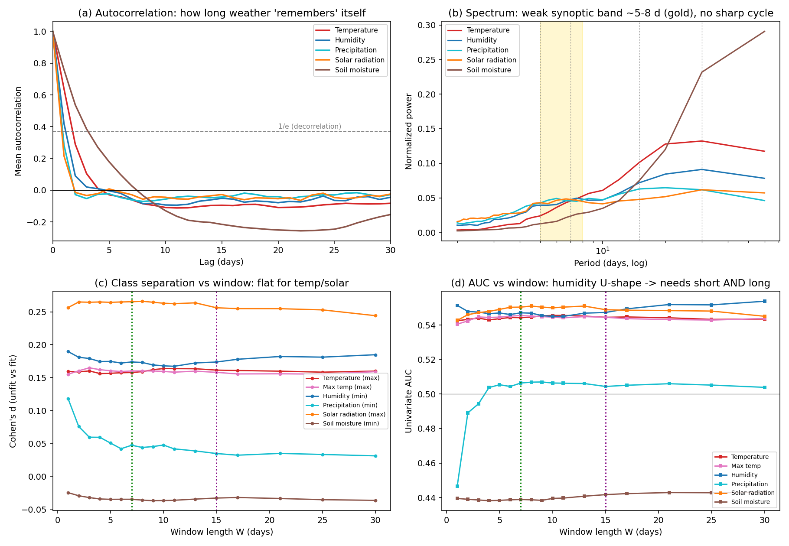

# 패턴·주기 탐지 — 알고리즘 조사와 우리 데이터 적용 결과 (교수님 보고)

> 교수님 지시(#3): "패턴·주기 반복을 확인하는 알고리즘을 조사·보고하고 우리 데이터에 실제로 적용하라."
> 모든 수치는 `analysis/pattern_results.json`·`analysis/multiscale_results.json`과 대조해 일치. 표·세부는 기술 원본 `reports/패턴주기_탐지_분석_보고서.md`에 있습니다.

---

## 1. 조사한 알고리즘 — "반복"은 두 종류

- **주기(periodicity)**: 일정 간격으로 같은 값이 돌아옴(예: 24시간 일주기) → **ACF**, **FFT/주기도**가 1차 도구
- **모티프(motif)**: 간격은 불규칙해도 같은 *모양* 토막이 반복(예: "3일 폭염 뒤 비") → **Matrix Profile**(후속 권고)

| 도구 | 원리(한 줄) | 우리 데이터 적용성 |
|---|---|---|
| **ACF** 자기상관 | k일 민 자신과 닮은 정도. 1/e 아래로 떨어지는 lag = "기억 길이" | ★★★ 커널 **하한**을 줌 |
| **FFT/주기도** | 신호를 사인파 합으로 분해, 봉우리=강한 주기 | ★★★ "고정 주기 있나"에 직답 |
| **Matrix Profile** | 모든 토막을 비교해 가장 닮은 이웃 거리 기록, 작은 곳=반복 모양 | ★★★ 모티프 후속 분석 |
| Lomb–Scargle / STL / 웨이블릿 / Hurst·DFA / EMD | 결측 주파수 / 추세·계절 분해 / 시간-주파수(Torrence & Compo 1998) / 추세지속성 / 비선형 분해 | ★★ 보조·확장 |

- **우리 데이터**: 검사 샘플 80,883건, 각 샘플에 검사 직전 **60일치 날씨 10변수**(기온·습도·강수·기압·일사·토양수분 등). 부적합 316건(0.39%).
- 자연 날씨는 깨끗한 고정 주기 신호가 아니라 **추세(계절) + 빠른 잡음(synoptic)** = 통계상 **적색잡음(red noise)**. → "정확히 7일마다"를 찾기보다 **의미 있는 '시간 규모'를 측정**하는 접근이 맞음. 그래서 1차로 ACF·FFT를 전 샘플에 적용.

## 2. 적용한 방법 (3가지)

- **① ACF로 '기억 길이' 측정** — 변수별 60일 창에서 선형추세 제거(계절 드리프트가 ACF를 인위적으로 늘림) → 평균 ACF가 1/e로 떨어지는 lag.
- **② FFT로 '고정 주기 유무'** — 추세 제거 + Hann 창 + 여러 샘플 주기도 평균(Welch) → 파워가 단(≤7일)·중(7~15일)·장(>15일) 주기 어디에 몰리나.
- **③ 다중 스케일 판별** *(커널 크기와 직결)* — "연속 W일 이동평균의 극값"이 부적합/적합을 가르는 정도를 **W=1~30일**에 Cohen's d·단일변수 AUC로 측정. (위험이 "하루 반짝"이 아니라 "며칠 지속 조건"에서 커진다는 가설을 데이터로 검증)

## 3. 적용 결과

> **그림 읽는 법** — (a) ACF=기억 길이, (b) 스펙트럼=고정 주기 유무(5~8일 금색 대역), (c) Cohen's d·(d) AUC = 창 길이(W)별 부적합/적합 분리력.

**(a) ACF — 날씨의 기억 길이는 1~3일**
- 토양수분 **3.15일**(최장, 땅은 천천히 마르고 젖음) ＞ 기온 1.5~1.8 ＞ 습도 1.16 ＞ 강수 **0.88**·일사 **0.81**(최단, 비는 거의 매일 독립)
- → 현재 2번째 Conv1D 커널 **3일은 "하루치 잡음" 수준**이라 지속 조건 보기엔 짧음

**(b) FFT — 강한 고정 주기 없음, 5~8일 약한 봉우리만**
- 기온: 파워가 긴 쪽(>15일, **38%**)에 몰림 = "더운/추운 *계절*"이라는 느린 신호
- 습도·강수·일사: 짧은 쪽(≤7일)에 **48~61%**, **5~8일에 약한 봉우리**(중위도 고·저기압 1회 통과 = 종관규모 synoptic, 단 전체 파워의 ~5%로 약함)
- → "7일 주기가 또렷이 박혀있다"고 단언 불가 (자연 날씨 = 적색잡음)

**(c)(d) 다중 스케일 판별 — 변수마다 '최적 지속 길이'가 다름 (가장 중요한 발견)**
- **일사**: W=**8일**에서 분리력 최대(d=**0.27**, 전 변수 최대 / AUC 0.551), 7~8일 평정점
- **기온(평균·최고)**: 1~30일 거의 **평탄** → 신호 본질이 "더운 *계절*", 커널 길이에 둔감(5~10일 무방)
- **습도**: **U자형** — 급성(1일)·만성(21일↑) 양 끝 강, 중간(9~11일) 최약 → **단일 중간 커널이 최악, 짧은+긴 동시(multi-filter)가 데이터로 정당화**(교수님 "7일+15일" 가설과 부합)
- 강수: 급성(1일)만 / 토양수분: 신호 거의 없음
- ⚠️ 분리력 자체는 전반 약함(최대 d≈0.27, AUC≈0.55). 아플라톡신은 드물고 다요인이라 단일 날씨값 분별력이 약한 게 정상(작년 도메인변수 d≈0.22와 동급). **CNN 역할은 강한 주기 찾기가 아니라, 약한 단변량 신호들을 비선형으로 결합**해 분별력을 키우는 것.

## 4. 결론 → 커널 크기 설계로 연결

데이터가 말하는 의미 있는 **시간 규모 3개**:

| 규모 | 근거 | 커널 함의 |
|---|---|---|
| **1~3일** 기억 길이 | ACF 감쇠 | 커널 **하한**(3일=미세 평활) |
| **7~10일** 판별 정점 | 일사 8·기온 10·최고기온 7 | **단일 커널 1순위 ≈ 7일** (종관 사건 5~8일을 통째로 봄) |
| **15일↑** 만성·계절 | 기온 파워 38%, 습도 만성 21일↑ | **긴 커널 ≈ 15일** |

- **습도의 U자형이 결정타** — 급성·만성이 *따로* 작동하니 한 커널로 못 담음 → 5→7→9→15일 단일 커널 실험 + 7·15일 병렬(multi-filter) 실험으로 이어짐.
- **실험 결과: 단일 커널 7일에서 성능이 가장 좋았음** (상세: `reports/커널크기_설계근거.md`)

> **후속**: ① Matrix Profile로 부적합 316건 공통 위험 모티프 탐색, ② 웨이블릿으로 검사일 근접 시 특정 주기 강화 여부, ③ 변수 그룹별 커널 차등화(기온·일사=짧게, 습도=짧+긴 병렬).
> **정직성 메모**: 각 샘플의 60일 창 *내부* 구조 분석임. 검사일을 이어 붙인 연속 시계열의 연주기 분석은 범위 밖. "강한 고정 주기 없음"은 자연 날씨의 정상 성질이지 데이터 결함이 아님.
